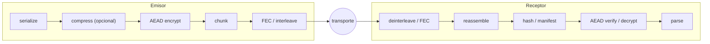
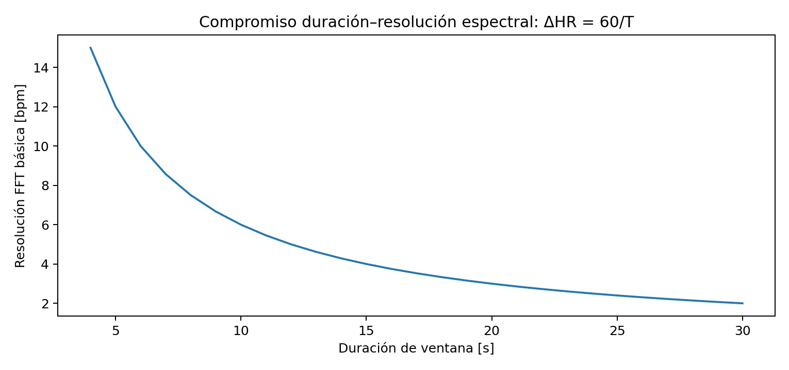
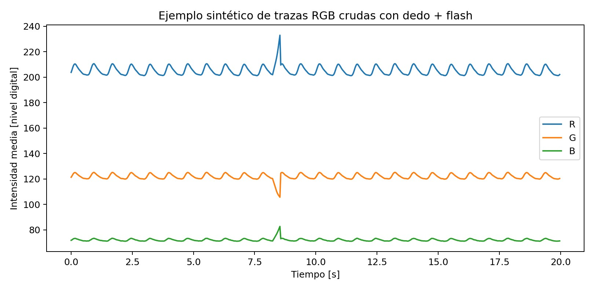
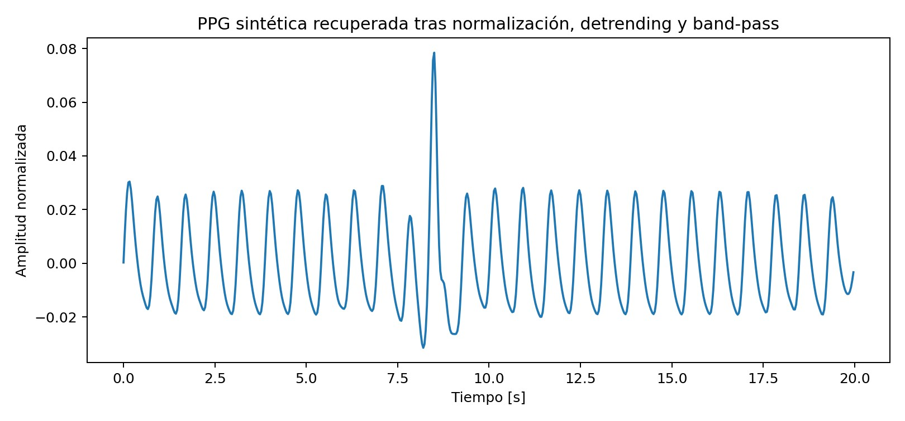
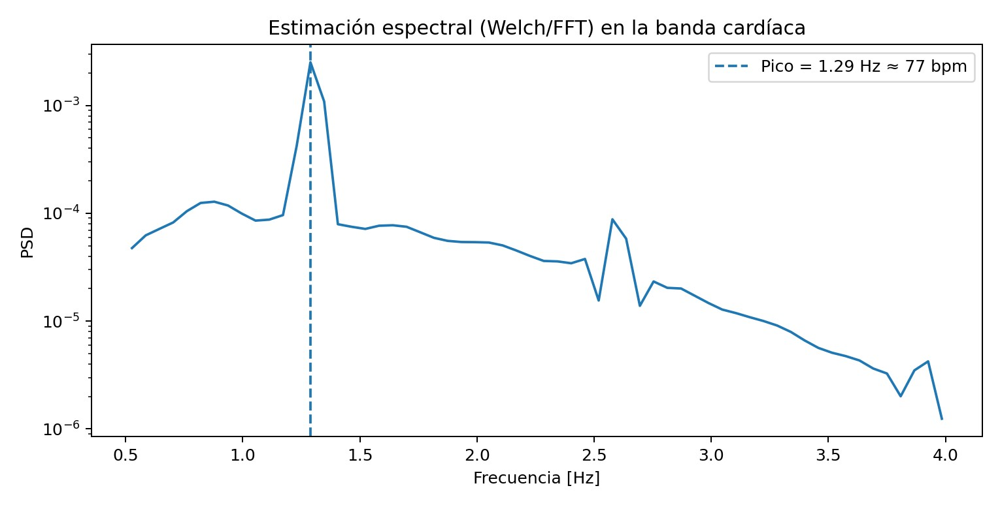
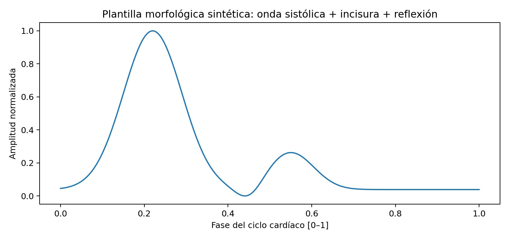
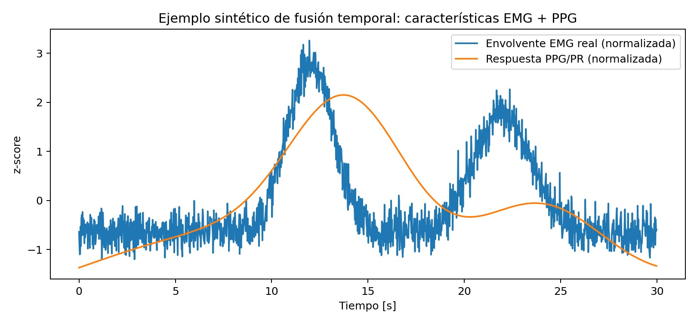

# team-26 Platanus Hack 26: Bogotá Project

**Current project logo:** project-logo.png


Track: 🚨Emergencies

team-26

- Alex Barraza Aristizábal ([@alexbzal](https://github.com/alexbzal))
- Miguel Aguilar ([@EclipseIDEHater](https://github.com/EclipseIDEHater))
- Jorge David Bustamante Pino ([@jorgeb-py](https://github.com/jorgeb-py))
- Helmut Chaparro Sandoval ([@hchaps404](https://github.com/hchaps404))
- Laura Fernanda Martinez Galindo ([@laura-martinez-galindo](https://github.com/laura-martinez-galindo))

Before Submitting:

- ✅ Fill in the project metadata (name, oneliner, description and deploy URL) in platanus-hack-project.jsonc

- ✅ Replace the contents of project-description.md with your project description in markdown

- ✅ Provide a 1000x1000 png project logo, max 500kb

- ✅ Provide a concise and to the point readme.

## ⚠️ Deploying & integrations (Vercel, Render, etc.)

Deploy platforms like **Vercel**, **Render** or **Netlify** can only connect to
repositories **you own** — they can't be granted access to this organization repo.
To deploy (or add any integration) while keeping your commits here, mirror your
code to a personal repo:

1. Create a **personal** repository on your own GitHub account.
2. Point your local `origin` at **both** repos, so a single `git push` updates each one:

   ```bash
   # this org repo (keep it as a push target)...
   git remote set-url --add --push origin https://github.com/platanus-hack/platanus-hack-26-co-team-26.git
   # ...and your personal repo
   git remote set-url --add --push origin https://github.com/<your-user>/<your-repo>.git
   ```

   From now on `git push` sends every commit to **both** repositories.
3. Connect your deploy service (Vercel, Render, …) to your **personal** repo and deploy from there.

Your commits stay mirrored here for judging, while the deploy runs from the repo you control.

Have fun! 🚀

---

## Estado del Arte — Comunicaciones y Dimensionamiento de Señal en Redes de Emergencia

Helius propone que teléfonos sin infraestructura de red (torres caídas, sin energía, sin Internet) formen una malla oportunista que mueva señales de estado, ubicación y biomarcadores entre sobrevivientes, rescatistas y un *gateway* eventual. Esa idea se apoya en tres cuerpos de conocimiento con madurez muy distinta: la teoría de comunicación clásica (Shannon, códigos de corrección de errores) está resuelta desde hace décadas; el enrutamiento oportunista/tolerante a demora (DTN) tiene fundamentos sólidos pero pocas validaciones en escombros reales; y la propagación de radio dentro de estructuras colapsadas es, en 2026, todavía un área activa de medición más que de modelos cerrados. Esta sección sintetiza ese estado del arte y lo convierte en fórmulas de dimensionamiento verificables, no en promesas de alcance.

**Qué está bien establecido.** El límite de capacidad de un canal ruidoso lo fijó Shannon en 1948 y sigue siendo el techo teórico contra el que se mide cualquier enlace [C1]. La corrección de errores por bloque (Reed-Solomon) es teoría de los años 60, hoy implementada en hardware de consumo (CDs, comunicaciones satelitales, y el propio decodificador de `ggwave`) [C2]. El modelo log-distance con *shadowing* aleatorio es el estándar de facto para presupuestar enlaces en entornos no ideales y aparece en cualquier texto de referencia de comunicaciones inalámbricas [C3].

**Qué está en debate o es frontera activa.** El enrutamiento epidémico/DTN —propuesto por Vahdat y Becker en 2000 para redes ad hoc particionadas [C4]— funciona bien en simulación, pero replicar sin control ("*flooding*") satura energía y ancho de banda; el diseño de *copy budgets* adaptativos sigue siendo objeto de investigación, y las revisiones recientes de DTN aplicado a desastres coinciden en que la mayoría de resultados provienen de simulación, no de despliegues reales en escombros [C5]. La propagación de RF dentro de edificios colapsados es el punto más débil de la literatura: NIST midió atenuación y variabilidad en estructuras públicas grandes antes, durante y después de un colapso controlado, y su conclusión central es que **no existe una única "pérdida por concreto"** generalizable — cada material, geometría y orientación de antena cambia el resultado varios dB [C6]. Los códigos *fountain* modernos (RaptorQ, estandarizado en el RFC 6330) resuelven mejor que Reed-Solomon el caso de fragmentos perdidos en ráfaga sobre enlaces intermitentes, pero su overhead real depende del patrón de pérdida observado, no de una cifra fija de fábrica [C7].

Las subsecciones siguientes formalizan cada uno de estos puntos como ecuaciones y tablas de dimensionamiento, pensadas para calibrarse con mediciones propias del equipo (ver protocolos experimentales en [C.7](#c7-protocolo-experimental-que-el-equipo-debe-levantar)).

> [!WARNING]
> Las ecuaciones y ejemplos numéricos de esta sección son modelos de ingeniería, no garantías de penetración de escombros ni de desempeño *life-safety*. Todo parámetro de canal debe recalibrarse con mediciones del dispositivo, orientación y material reales.

### Índice

- [C.0 Principios de medición y trazabilidad](#c0-principios-de-medición-y-trazabilidad)
- [C.1 De señal fisiológica a paquete transmisible](#c1-de-señal-fisiológica-a-paquete-transmisible)
- [C.2 Integridad y eficiencia del paquete](#c2-integridad-y-eficiencia-del-paquete)
- [C.3 Presupuesto de enlace y propagación en escombros](#c3-presupuesto-de-enlace-y-propagación-en-escombros)
- [C.4 Perfil por transporte: BLE, Wi-Fi Aware, UWB, acústico, IP](#c4-perfil-por-transporte-ble-wi-fi-aware-uwb-acústico-ip)
- [C.5 Redes tolerantes a demora entre múltiples celulares](#c5-redes-tolerantes-a-demora-entre-múltiples-celulares)
- [C.6 Métricas y selección adaptativa de transporte](#c6-métricas-y-selección-adaptativa-de-transporte)
- [C.7 Protocolo experimental que el equipo debe levantar](#c7-protocolo-experimental-que-el-equipo-debe-levantar)
- [C.8 Perfiles de mensaje y ejemplo de extremo a extremo](#c8-perfiles-de-mensaje-y-ejemplo-de-extremo-a-extremo)
- [C.9 Criterios de aceptación y referencias](#c9-criterios-de-aceptación-y-referencias)

---

### C.0 Principios de medición y trazabilidad

Un problema recurrente en proyectos de comunicación de emergencia es presentar una estimación calibrada en laboratorio como si fuera una garantía de campo. La literatura de propagación en desastres (NIST [C6], revisiones de DTN [C5]) es consistente en que la variabilidad entre escenarios es alta, así que el diseño correcto no es "asignar una precisión única a cada tecnología", sino que la aplicación **mida el estado real del enlace y conserve la incertidumbre**. Toda estimación se expresa con tres elementos: valor, intervalo/confianza y procedencia.

| Clase | Significado | Ejemplo |
|---|---|---|
| `MEASURED` | Valor medido directamente | RSSI = -78 dBm, 34 fragmentos recibidos |
| `DERIVED` | Calculado a partir de mediciones | PER estimado = 0.12, HR = 112 bpm |
| `ASSUMED` | Parámetro de diseño aún no calibrado | n = 3.1 en log-distance |
| `REFERENCE` | Parámetro de norma o documentación | BLE LE 1M PHY = 1 Mbit/s (protocol data rate) |
| `IMPUTED` | Inferido para continuidad; nunca RAW | trayectoria probable entre dos fixes GNSS |

> [!IMPORTANT]
> **Regla central:** una inferencia nunca reemplaza al dato original. Si un paquete no puede reconstruirse bit a bit y verificarse criptográficamente, se conserva como incompleto/corrupto. Cualquier reconstrucción semántica se almacena en un campo separado y **nunca** se usa como evidencia canónica.

<details>
<summary><b>Formalización de apoyo — notación y magnitudes</b></summary>

| Símbolo | Definición | Unidad |
|---|---|---|
| `fs` | Frecuencia de muestreo | Hz |
| `N` | Número de muestras o bits | — |
| `B` | Ancho de banda | Hz |
| `Pt, Pr` | Potencia transmitida/recibida | dBm |
| `PL` | Pérdida de trayecto | dB |
| `SNR` | Relación señal-ruido | dB |
| `BER` | Bit Error Rate | bit/bit |
| `PER` | Packet Error Rate | paquete/paquete |
| `Rc = k/n` | Tasa de código FEC | — |
| `G` | Goodput de payload útil | bit/s |
| `eta` | Eficiencia | 0..1 |
| `Ebit` | Energía por bit entregado | J/bit |

</details>

---

### C.1 De señal fisiológica a paquete transmisible

La fotopletismografía (PPG) por cámara + flash es, dentro de este proyecto, la fuente de datos que primero entra a la red: un valor de pulso o una forma de onda deben empaquetarse antes de viajar por BLE, Wi-Fi Aware o audio. La fundamentación fisiológica y óptica completa —qué tan defendible es cada salida, cómo se extrae la señal, qué tan lejos está SpO2 de ser confiable con RGB— se desarrolla en detalle en la sección [Estado del Arte — PPG con Cámara y Fusión Multimodal](#-estado-del-arte--ppg-con-cámara-y-fusión-multimodal-biosignals) más abajo. Aquí solo interesa el contrato de datos: qué tamaño y qué forma tiene el objeto que el subsistema de comunicaciones debe transportar.

<details>
<summary><b>Formalización de apoyo — modelo óptico de primer orden</b></summary>

Para una banda espectral efectiva `lambda`, un modelo útil de primer orden es una forma modificada de Beer–Lambert:

```
I_lambda(t) = I0_lambda * exp[-mu_a,lambda(t) * L_eff(t)] * K_lambda(t)
```

Una transformación robusta para pequeñas variaciones es la densidad óptica relativa:

```
OD_c(t) = -ln( I_c(t) / Iref_c(t) )
x_c(t) = [I_c(t) - DC_c(t)] / DC_c(t)
```

El signo puede invertirse según el *pipeline* de la cámara; la frecuencia de los picos no cambia por esa inversión. Con `fs=30 fps`, Nyquist es 15 Hz, ampliamente por encima de la banda cardíaca (0.5–4 Hz):

```
f_Nyquist = fs/2          Delta_f = 1/T          Delta_HR = 60/T [bpm]
```

| Ventana T | Resolución FFT (Δf) | ΔHR teórica |
|---|---|---|
| 8 s | 0.125 Hz | 7.5 bpm |
| 10 s | 0.100 Hz | 6.0 bpm |
| 15 s | 0.0667 Hz | 4.0 bpm |
| 20 s | 0.050 Hz | 3.0 bpm |

</details>

---

### C.2 Integridad y eficiencia del paquete

Todo transporte debe entregar el mismo objeto lógico al *Bundle Layer*, y ese objeto necesita dos garantías independientes: **eficiencia** (cuántos bytes útiles viajan por byte transmitido) e **integridad** (si el objeto llega, ¿es exactamente el que se envió?). La corrección de errores por bloque es teoría resuelta desde Reed y Solomon (1960) [C2] — lo interesante para SismoMesh no es reinventar el código, sino elegir el código correcto para el patrón de pérdida real: errores independientes de bit favorecen ARQ; ráfagas y *erasures* por contactos breves favorecen FEC/*erasure coding*. Ahí es donde entra RaptorQ (RFC 6330): a diferencia de un código de bloque fijo, genera *repair symbols* bajo demanda y tolera perder casi cualquier subconjunto de fragmentos, con un *overhead* que depende de la pérdida observada, no de una constante universal [C7].

<details>
<summary><b>Formalización de apoyo — modelo de paquete, BER→PER, ARQ, FEC</b></summary>

```
B_tx = (P + H + A) / Rc
eta_payload = P / B_tx = Rc*P/(P+H+A)
```

**Ejemplo:** `P=256B, H=48B, A=16B, Rc=0.80` → `B_tx=400B`, `eta_payload=64%`.

**BER → PER**, con errores de bit independientes y `N` bits por paquete:

```
PER = 1 - (1-p_b)^N
```

| BER | PER calculado | Retransmisiones esperadas `1/(1-PER)` |
|---|---|---|
| 1e-6 | 0.319% | 1.003 |
| 1e-5 | 3.149% | 1.033 |
| 1e-4 | 27.386% | 1.377 |

**ARQ**, con `PER=p` y máximo `M` intentos:

```
P_success(M) = 1 - p^M          E[N_tx] = (1-p^M)/(1-p)
```

**Reed-Solomon** para código de bloque `(n,k)`, `Rc=k/n`, corrige hasta `t=floor((n-k)/2)` símbolos erróneos o `n-k` *erasures*: `2*e + s <= n-k`. Ejemplo RS(255,223): `Rc=0.8745`, corrige hasta 16 errores o 32 *erasures*.

**RaptorQ / erasure ideal**, probabilidad de reconstrucción con `n` símbolos transmitidos, `k` requeridos, pérdida independiente `p`:

```
P_rec = sum_{i=k..n} C(n,i)*(1-p)^i*p^(n-i)
```

| k | n | Pérdida p | P_rec ideal |
|---|---|---|---|
| 20 | 20 | 25% | 0.32% |
| 20 | 24 | 25% | 24.66% |
| 20 | 26 | 25% | 51.54% |
| 20 | 28 | 25% | 75.01% |
| 20 | 30 | 25% | 89.43% |

RFC 8681 (*sliding-window FEC*) evita esperar el final de un bloque y es candidato para telemetría continua si su costo CPU/energía compensa frente a RaptorQ por bloques. Un *interleaver* de profundidad `D` dispersa una ráfaga de `b` símbolos en `ceil(b/D)` errores por *codeword*, a costa de latencia y memoria.

**Cadena de integridad recomendada:**



CRC detecta errores accidentales; no autentica. Un hash criptográfico y/o AEAD verifica integridad fuerte. Si el objeto no verifica, **no** se convierte en mensaje canónico.

</details>

> [!IMPORTANT]
> Un LLM (p. ej. Claude) puede producir una "hipótesis semántica" solo después de que la recuperación exacta falle — por ejemplo, sugerir que `"NEC_SITO AYU_A"` probablemente era `"NECESITO AYUDA"`. Esa salida debe marcarse `IMPUTED/UNVERIFIED`, conservar el fragmento original y excluirse de decisiones automáticas. **Nunca se firma como si fueran bytes recuperados.**

---

### C.3 Presupuesto de enlace y propagación en escombros

Este es, con evidencia disponible en 2026, el punto más incierto de todo el sistema. El presupuesto de enlace en espacio libre (`FSPL`) es álgebra elemental y no está en discusión; lo que sí está en discusión es cuánto se degrada ese número real dentro de una estructura colapsada. El estudio de referencia más citado en este espacio —mediciones de NIST antes, durante y después del colapso controlado de tres edificios públicos grandes— encontró atenuación y *scattering* fuertes y **muy variables** entre escenarios, y advierte explícitamente contra convertir una medición puntual en una "pérdida de concreto" universal [C6]. Rappaport formaliza el modelo log-distance con *shadowing* que se usa para capturar precisamente esa variabilidad como término aleatorio, en vez de una constante [C3].

<details>
<summary><b>Formalización de apoyo — FSPL, log-distance, Shannon, margen de enlace</b></summary>

```
Pr[dBm] = Pt + Gt + Gr - FSPL - L_materiales - L_cuerpo - L_misc
FSPL[dB] = 32.44 + 20*log10(f_MHz) + 20*log10(d_km)
```

| Frecuencia | Distancia | FSPL |
|---|---|---|
| 2.4 GHz | 5 m | 54.0 dB |
| 2.4 GHz | 10 m | 60.0 dB |
| 5 GHz | 10 m | 66.4 dB |
| 6.5 GHz (UWB) | 10 m | 68.7 dB |

**Modelo log-distance calibrable:**

```
PL(d) = PL(d0) + 10*n*log10(d/d0) + X_sigma
n_hat = argmin_n sum_i [PL_i - PL(d0)-10*n*log10(d_i/d0)]^2
```

Separar al menos: LOS, NLOS, concreto, concreto reforzado, escombros mixtos y presencia de cuerpo. Reportar mediana y percentiles, no solo promedio.

**Ruido, SNR y límite de Shannon** [C1]:

```
N[dBm] = -174 + 10*log10(B_Hz) + NF
C = B*log2(1+SNR_linear)
```

Shannon es un límite teórico, no el *throughput* que verá la app; el *goodput* se mide extremo a extremo tras cabeceras, FEC, *scheduling* y cifrado.

**Margen de enlace:** `M_link = Pr - S_min`, donde `S_min` es la sensibilidad efectiva del receptor; si la API no la expone, se obtiene reduciendo RSSI/atenuación hasta que PER cruce el umbral de diseño.

</details>

---

### C.4 Perfil por transporte: BLE, Wi-Fi Aware, UWB, acústico, IP

Ningún transporte único cubre todo el problema, y esa es precisamente la razón de ser de una malla multi-radio: cada tecnología resuelve un punto distinto del compromiso alcance–*goodput*–energía. Bluetooth SIG documenta cuatro perfiles PHY para BLE con *trade-off* explícito entre robustez y tasa [C4-cita interna]; Wi-Fi Aware/NAN resuelve *discovery* P2P sin infraestructura pero con soporte de hardware desigual entre fabricantes; UWB aporta *ranging* de alta precisión pero exige *out-of-band discovery* y solo tiene sentido line-of-sight; el canal acústico (`ggwave`, FSK multifrecuencia) es el transporte de último recurso —lentísimo, pero funciona sin radio alguna.

<details>
<summary><b>Formalización de apoyo — BLE</b></summary>

| PHY BLE | Protocol data rate | Aplicación aprox. máx.* | Rol SismoMesh |
|---|---|---|---|
| LE 2M | 2 Mbit/s | ~1.4 Mbit/s | *bulk* corto si ambos soportan |
| LE 1M | 1 Mbit/s | ~0.8 Mbit/s | control / transferencia general |
| LE Coded S=2 | 0.5 Mbit/s | ~0.4 Mbit/s | robustez |
| LE Coded S=8 | 0.125 Mbit/s | ~0.1 Mbit/s | máxima robustez relativa |

\* Valores del *Bluetooth LE Primer* [T7], no garantías de smartphone. `T_tx >= 8*B_tx / G_goodput`; la app debe medir `G_goodput` real, no inferirlo del PHY.

</details>

<details>
<summary><b>Formalización de apoyo — Wi-Fi Aware, UWB, acústico, IP</b></summary>

**Wi-Fi Aware/NAN:** sin cifra única de *throughput* codificable; se mide TTFC, RTT, *goodput*, PER y estabilidad. `B_contact_max ~= G_goodput * Tc / 8`.

**UWB:** *time-of-flight* `d = c*t_prop`; en *asymmetric double-sided TWR*: `t_prop = (Tround1*Tround2 - Treply1*Treply2)/(Tround1+Tround2+Treply1+Treply2)`. Android documenta que la distancia se refiere a *line-of-sight*; en NLOS/escombros las coordenadas pueden sesgarse.

**Acústico (`ggwave`):** FSK con 8–16 bytes/s, `F0=15000 Hz`, `Delta_f=46.875 Hz`, 96 tonos entre ~15.0–19.45 kHz. `T_audio >= B_encoded/R_audio` — por eso el audio transporta IDs/SOS compactos, nunca PPG RAW.

**Internet/IP:** cuando existe IP, el objetivo deja de ser inventar un PHY y pasa a preservar identidad extremo a extremo con hash/firma del *bundle*, porque el mismo objeto puede haber atravesado varios *relays* y transportes.

</details>

---

### C.5 Redes tolerantes a demora entre múltiples celulares

El enrutamiento epidémico de Vahdat y Becker (2000) sigue siendo la referencia fundacional de DTN: replicar mensajes entre *carriers* que se cruzan intermitentemente, sin ruta punto a punto garantizada [C4]. Su fortaleza —maximizar probabilidad de entrega ante topología impredecible— es también su debilidad: sin control, "*flooding*" satura batería y espectro. Las revisiones más recientes de DTN aplicado a desastres son claras en que la mayoría de la evidencia es de simulación y que el *copy budget* adaptativo (más réplicas para SOS, menos para *bulk*) es la mitigación estándar, no una solución cerrada [C5].

<details>
<summary><b>Formalización de apoyo — entrega, costo de replicación, Bloom filter</b></summary>

```
T_delivery = sum(T_wait_contact_i + T_handshake_i + T_transfer_i)
D_i = Gi*Tc_i
```

**Probabilidad de entrega por replicación**, `r` *carriers* independientes con probabilidad `q_j`:

```
P_deliver = 1 - product_j(1-q_j)
```

Ejemplo idealizado `q=0.25, r=5` → `76.3%`; en un derrumbe los contactos están correlacionados, el valor real puede ser menor.

**Costo de replicación:** `Replication_cost = bytes_tx_total / bytes_unique_delivered`.

**Bloom filter** para inventarios de `bundle_ids` [C8], `m` bits, `n` elementos, `k` hashes:

```
P_false_positive ~= (1-exp(-k*n/m))^k          k_opt ~= (m/n)*ln(2)
```

Un falso positivo implica creer que el *peer* ya tiene un *bundle* que en realidad falta; no usar solo para P0 sin reconciliación/ACK.

</details>

---

### C.6 Métricas y selección adaptativa de transporte

<details open>
<summary><b>Formalización de apoyo — métricas y score de transporte</b></summary>

| Métrica | Fórmula | Interpretación |
|---|---|---|
| Payload efficiency | `eta_p = P/B_tx` | Fracción de bytes útiles |
| Goodput | `G = 8*B_payload_ok/T` | Bits/s verificados |
| Delivery ratio | `BDR = N_bundles_ok/N_bundles_created` | Fiabilidad DTN |
| Energy/bit | `Ebit = E_J/(8*B_ok)` | Costo energético |
| Contact utilization | `U = B_ok/B_contact_max` | Aprovechamiento del encuentro |
| Retransmission factor | `RF = N_tx/N_unique` | Sobrecosto ARQ/relay |
| FEC overhead | `OH = (n-k)/k` | Redundancia |
| Deadline delivery | `P(T_delivery<=D)` | Probabilidad operacional |

```
Score_j = wD*Pdeliver_j - wE*Ebit_j - wL*Latency_j + wG*Goodput_j - wC*SetupCost_j
```

- **Tier 0 (SOS/estado):** BLE + replicación amplia; audio solo para payload ultracompacto.
- **Tier 1 (resumen de sensores):** BLE/Wi-Fi Aware/Internet según *goodput* medido.
- **Tier 2 (RAW PPG/IMU):** Wi-Fi Aware o Internet; BLE solo si tiempo/batería lo permiten.
- **UWB:** solo tras *OOB discovery*, solo para *ranging*.

</details>

> [!NOTE]
> No usar Claude (ni ningún LLM) para elegir directamente el radio sin restricciones. Claude puede **recomendar**; el *policy engine* aplica los límites de batería, permisos y seguridad.

---

### C.7 Protocolo experimental que el equipo debe levantar

<details>
<summary><b>Formalización de apoyo — bancos de prueba (PPG, RF, FEC/DTN, acústico)</b></summary>

**Banco RF por material** — registrar distancia, orientación, material, humedad, RSSI, PHY, bytes verificados, PER, TTFC, energía y temperatura; no usar solo RSSI:

| Escenario | Distancias sugeridas | Repeticiones |
|---|---|---|
| LOS | 1, 3, 5, 10, 20 m | ≥30 contactos |
| 1 pared/ladrillo | 1, 3, 5, 10 m | ≥30 |
| Concreto | 1, 3, 5, 10 m | ≥30 |
| Concreto reforzado | seguro y autorizado | ≥30 |
| Escombro mixto simulado | varias geometrías | ≥30 |
| Cuerpo/orientación | 4 orientaciones | ≥30 |

Ajustar log-distance por escenario y construir curvas `P(success | RSSI, material, transporte)` — más útiles que convertir RSSI directamente a metros.

**Banco FEC/DTN:** inyectar pérdidas reproducibles `p=0,5,10,20,30,40%` y ráfagas de 2–20 fragmentos; comparar no-FEC, ARQ, RS, RaptorQ y *sliding-window*; medir *recovery rate*, *overhead*, CPU, batería y latencia.

**Banco acústico:** medir por modelo de teléfono frecuencia de muestreo real, respuesta 15–20 kHz, SNR, *decode rate* y distancia en LOS, grietas y conductos.

</details>

---

### C.8 Perfiles de mensaje y ejemplo de extremo a extremo

<details>
<summary><b>Formalización de apoyo — perfiles de mensaje y ejemplo numérico</b></summary>

| Perfil | Contenido | Tamaño objetivo | FEC/Integridad | Transportes |
|---|---|---|---|---|
| Beacon P0 | `ephemeral_id`, `incident_id`, flags, seq | ≤20–40 B | CRC/link + auth | BLE advertising |
| SOS P0 | status, timestamp, coarse location | ≤64–128 B | AEAD + repetición/FEC | BLE, Wi-Fi Aware, audio |
| Summary P1 | location, battery, motion, HR+SQI | ~0.2–1 kB | AEAD + block FEC | BLE/Wi-Fi/Internet |
| Manifest P1 | hashes, chunk map, provenance | ~0.2–2 kB | firma de origen | todos menos UWB |
| RAW P2 | PPG/IMU/camera-derived series | kB–MB | chunk hashes + RaptorQ | Wi-Fi Aware/Internet |

**Ejemplo de laboratorio:** Summary con `P=256B, H=48B, tag=16B, Rc=0.8` → `B_tx=400B`. Con `G=100 kbit/s`, tiempo de aire ideal ≥32 ms. BER `1e-5` sobre 3200 bits → `PER~3.15%`, ARQ ~1.033 intentos esperados. Con *erasures* del 25% por contactos abruptos, 20 *source symbols* necesitan `n=28` para `P_rec~75%` o `n=30` para `~89.4%`.

Al recibir: **FEC reconstruye → hash verifica → AEAD autentica → parser decodifica.** Solo entonces el *bundle* cambia a `VERIFIED`.

</details>

---

### C.9 Criterios de aceptación y referencias

- Toda constante empírica (`n`, `sigma`, *goodput*, energía, SQI *thresholds*) debe tener *dataset* y versión de calibración.
- Todo *bundle* RAW debe tener hash/manifest y estado `VERIFIED/CORRUPT/PARTIAL`. No existe estado "corregido por IA" equivalente a `VERIFIED`.
- Todo resultado de rango UWB debe guardar distancia, *azimuth/elevation*, *timestamp* y condición LOS/NLOS.
- Toda afirmación de alcance se expresa como probabilidad de *discovery/delivery* bajo escenario medido, no como metros garantizados.
- Toda comparación de protocolos reporta al menos *goodput*, TTFC, *bundle delivery ratio*, energía/bit y *deadline delivery*.

**Obras fundacionales:**

| Ref | Fuente |
|---|---|
| C1 | Shannon, C.E. (1948). *A Mathematical Theory of Communication.* Bell System Technical Journal, 27, 379–423. [Wiley](https://onlinelibrary.wiley.com/doi/10.1002/j.1538-7305.1948.tb01338.x) |
| C2 | Reed, I.S. & Solomon, G. (1960). *Polynomial Codes over Certain Finite Fields.* J. SIAM, 8, 300–304. [PDF](https://www.cs.cornell.edu/courses/cs722/2000sp/ReedSolomon.pdf) |
| C3 | Rappaport, T.S. *Wireless Communications: Principles and Practice*, 2nd ed. Prentice Hall / Cambridge University Press. [Cambridge](https://www.cambridge.org/highereducation/books/wireless-communications/AA60B0544B0619E629A9B6FF98B17161) |
| C4 | Vahdat, A. & Becker, D. (2000). *Epidemic Routing for Partially-Connected Ad Hoc Networks.* Duke CS-2000-06. [PDF](http://issg.cs.duke.edu/epidemic/epidemic.pdf) |
| C6 | NIST. *Propagation Measurements Before, During, and After Collapse of Three Large Public Buildings.* [nist.gov](https://www.nist.gov/publications/propagation-measurements-during-and-after-collapse-three-large-public-buildings) |
| C8 | Bloom, B.H. (1970). *Space/Time Trade-Offs in Hash Coding with Allowable Errors.* CACM, 13, 422–426. [PDF](https://crystal.uta.edu/~mcguigan/cse6350/papers/Bloom.pdf) |

**Literatura aplicada y normativa (2024–2026):**

| ID | Fuente | URL |
|---|---|---|
| T5 | Android Developers — `WifiAwareManager` | https://developer.android.com/reference/android/net/wifi/aware/package-summary |
| T6 | Apple Developer — Wi-Fi Aware (iOS 26, TN3111) | https://developer.apple.com/documentation/WiFiAware |
| T7 | Bluetooth SIG — Bluetooth LE Primer | https://www.bluetooth.com/wp-content/uploads/2022/05/Bluetooth_LE_Primer_Paper.pdf |
| T8 | Android Developers — Jetpack UWB | https://developer.android.com/develop/connectivity/uwb |
| T9 | Apple — Nearby Interaction with UWB Interoperability Spec. | https://developer.apple.com/download/files/Nearby-Interaction-with-UWB-Interoperability-Specification-Developer-Preview-R4.pdf |
| T10 | ggerganov/ggwave — data-over-sound, FSK, Reed-Solomon | https://github.com/ggerganov/ggwave |
| T11 | RFC 6330 — RaptorQ Forward Error Correction Scheme | https://datatracker.ietf.org/doc/html/rfc6330 |
| T12 | RFC 8681 — Sliding Window Random Linear Code FEC | https://www.rfc-editor.org/rfc/rfc8681 |
| DTN-survey | *Delay Tolerant Networks: Protocols and Applications.* Vasilakos, A.V. et al. (eds.), Taylor & Francis, 2011 — referencia de libro sobre DTN aplicado. | — |

*Estado tecnológico verificado: 22 de agosto de 2026. Para APIs móviles, reverificar compatibilidad exacta por OS/dispositivo antes de congelar release.*

---

## Estado del Arte — PPG con Cámara y Fusión Multimodal (Biosignals)

La segunda pieza de datos que SismoMesh intenta capturar es evidencia fisiológica: ¿la persona tiene pulso?, ¿está en un estado de activación elevada?, ¿hay indicios de dolor? La fotopletismografía (PPG) con cámara y flash de un smartphone es, con diferencia, la señal biomédica mejor estudiada en teléfonos de consumo — su fundamento óptico se remonta a la revisión clásica de Allen (2007), hoy con más de 2000 citas y todavía el punto de partida obligado de cualquier trabajo en el área [B1]. Ese no es el caso del resto de señales que este proyecto querría inferir: electromiografía (EMG), saturación de oxígeno (SpO2), dolor o estado de ánimo. Ahí la ciencia es mucho más desigual, y el estado del arte importa tanto por lo que permite como por lo que **explícitamente no respalda**.

**Qué está bien establecido.** La frecuencia de pulso por PPG de cámara es viable si la señal pasa control de calidad — revisiones sistemáticas recientes (2024) confirman validez frente a ECG bajo condiciones controladas, con la salvedad constante de que el movimiento, la presión del dedo y el modelo de cámara dominan el error [B2]. El principio óptico (componente AC pulsátil sobre DC lento) es física de transporte de luz en tejido bien descrita desde hace más de una década [B1].

**Qué está en debate.** La variabilidad de pulso (PRV) obtenida de PPG **no es intercambiable** con la variabilidad de frecuencia cardíaca (HRV) obtenida de ECG: un estudio clínico grande y diverso de 2025 documenta desacuerdos relevantes entre ambas métricas en varias poblaciones, justo el tipo de generalización que un proyecto de emergencia no puede asumir sin validar [B3]. La oximetría de pulso por cámara RGB sigue siendo, según la propia FDA, un problema no resuelto de forma general: incluso oxímetros dedicados tienen limitaciones documentadas de precisión por pigmentación de piel, y una cámara RGB+flash está aún más lejos del estándar rojo/infrarrojo calibrado [B4][B5].

**Dónde está la frontera.** Inferir estado emocional o dolor a partir de una sola señal periférica es, en 2026, terreno de investigación activa y no un problema resuelto. El modelo circumplejo de Russell (1980) —la base teórica de casi todo el campo de *affective computing*— separa *arousal* (activación) de *valencia* (positivo/negativo) precisamente porque son dimensiones independientes [B6]; Picard formalizó en 1997 el programa de investigación completo de reconocer emoción por señal fisiológica y ya entonces distinguía entre "señal que correlaciona con activación" y "señal que identifica la emoción específica" [B7]. Los trabajos más recientes en reconocimiento de dolor por biosignals confirman ese límite: combinan ECG/BVP, EDA, EMG y auto-reporte, y ninguno reclama que una sola modalidad óptica baste para inferir dolor con confianza clínica [B8].

Estas tres capas —lo establecido, lo debatido y la frontera— son las que estructuran el resto de esta sección: primero cómo se extrae y valida la señal (secciones B.0–B.9), después qué tan lejos se puede llegar honestamente hacia oxigenación, EMG y estimadores de estado (B.10–B.13), y finalmente cómo se integra en la arquitectura del producto (B.14–B.17).

> [!CAUTION]
> Este contenido es de investigación e ingeniería — no constituye dispositivo médico ni diagnóstico clínico. Las salidas de estrés, dolor, perfusión u oxigenación se tratan como evidencia/proxy con incertidumbre, nunca como diagnóstico.

### Índice

- [B.0 Decisiones de diseño que no deben romperse](#b0-decisiones-de-diseño-que-no-deben-romperse)
- [B.1 Alcance y lenguaje de seguridad](#b1-alcance-y-lenguaje-de-seguridad)
- [B.2 Del píxel a la serie temporal PPG](#b2-del-píxel-a-la-serie-temporal-ppg)
- [B.3 Extracción, calidad y frecuencia de pulso](#b3-extracción-calidad-y-frecuencia-de-pulso)
- [B.4 PPG sintética como banco de pruebas](#b4-ppg-sintética-como-banco-de-pruebas)
- [B.5 Métricas derivables: PRV, respiración, perfusión](#b5-métricas-derivables-prv-respiración-y-perfusión)
- [B.6 Oxigenación: el límite honesto de RGB](#b6-oxigenación-el-límite-honesto-de-rgb)
- [B.7 EMG real y fusión con PPG](#b7-emg-real-y-fusión-con-ppg)
- [B.8 Estimadores no diagnósticos de activación, dolor y estado](#b8-estimadores-no-diagnósticos-de-activación-dolor-y-estado)
- [B.9 Arquitectura, protocolo de validación e integración](#b9-arquitectura-protocolo-de-validación-e-integración)
- [B.10 Tabla maestra de capacidades y referencias](#b10-tabla-maestra-de-capacidades-y-referencias)

---

### B.0 Decisiones de diseño que no deben romperse

> [!WARNING]
> **1. La cámara mide PPG, no EMG.** El PPG es óptico y refleja cambios de volumen sanguíneo periférico. El EMG es un biopotencial eléctrico muscular y requiere electrodos/sensor dedicado. Si no hay EMG físico, **no debe generarse un "EMG estimado"** ni presentarse como señal medida.

> [!WARNING]
> **2. PPG de smartphone puede estimar pulso; SpO2 es mucho más difícil.** Una cámara RGB + flash **no equivale** a un oxímetro rojo/IR calibrado [B4][B5]. Se recomienda registrar características RGB/*ratio-of-ratios* como modo experimental, no reportar SpO2 clínica sin validación específica por dispositivo y población.

> [!WARNING]
> **3. "Estado de ánimo" no sale de una sola señal.** PPG aporta evidencia de activación autonómica/*arousal*; valencia, dolor o *shock* no deben inferirse de PPG aislado [B6][B7].

> [!IMPORTANT]
> **4. Toda salida debe tener SQI + procedencia + confianza.** Ejemplo: `pulse_rate=118 bpm, SQI=0.89, source=camera_ppg, window=12 s`. Si una inferencia es experimental, se etiqueta `DERIVED/EXPERIMENTAL` y nunca sustituye una medición clínica.

---

### B.1 Alcance y lenguaje de seguridad

El objetivo del proyecto es **triage y evidencia de actividad** en contexto de emergencia, no diagnóstico médico autónomo. Cada salida debe declarar su estado de madurez:

| Salida | Estado recomendado | Interpretación |
|---|---|---|
| Pulso / frecuencia de pulso | `ENGINEERING` / validable | Estimable con PPG si el SQI es suficiente [B2]. |
| Presencia de pulsación | `ENGINEERING` | Evidencia óptica de componente pulsátil; no prueba estabilidad clínica por sí sola. |
| PRV | `EXPERIMENTAL` | Variabilidad de intervalos de pulso; no es HRV sin ECG [B3]. |
| Respiración desde PPG | `EXPERIMENTAL` | Extraíble si ventana y SQI lo permiten. |
| Índice de perfusión relativo | `EXPERIMENTAL` | AC/DC intra-dispositivo; sensible a presión, exposición, tono de piel. |
| SpO2 con RGB | `RESEARCH` | Requiere calibración y validación; no equivalente a rojo+IR [B4][B5]. |
| Estrés/*arousal* | `RESEARCH` / evidencia | *Score* fisiológico posible; no identifica causa [B6][B7]. |
| Dolor | `RESEARCH` / multimodal | Solo probabilidad contextual, idealmente con auto-reporte + EMG/EDA [B8]. |
| Estado de ánimo/valencia | `UNSUPPORTED` con PPG solo | No hay mapeo robusto PPG→"triste/feliz" de uso general [B6]. |
| EMG desde cámara | `UNSUPPORTED` | La cámara no mide potencial eléctrico muscular. |

---

### B.2 Del píxel a la serie temporal PPG

La adquisición debe reducir la "inteligencia automática" de la cámara que deforma la señal: *torch* continuo, exposición/AWB bloqueados tras estabilización, foco fijo, 30 fps nominal y ventanas de 8–20 s son la configuración de arranque recomendada por la literatura de validación en smartphone [B2][B9].

<details>
<summary><b>Formalización de apoyo — modelo óptico, ROI y compromiso duración/resolución</b></summary>

```
I_c(t) = DC_c(t) + AC_c(t) + n_c(t)          c ∈ {R,G,B}
I_c(t) ≈ I0_c · exp[-μ_eff,c(t)·L_eff,c]
ΔOD_c(t) = -ln( I_c(t) / I_ref,c )
```

Serie RGB por frame sobre una ROI que excluye píxeles saturados/oscuros:

```
R[n] = (1/N_valid)·Σ_{p∈ROI_valid} R_p[n]     (ídem G[n], B[n])
```

<p align="center"></p>

*Relación teórica ΔHR=60/T entre duración de ventana y resolución FFT: T=8s→7.5bpm; T=20s→3bpm.*

<p align="center"></p>

*Ejemplo sintético de medias RGB por frame; el transitorio ~8.3s representa un artefacto de movimiento que debe penalizar el SQI.*

**Controles de calidad óptica:** *clipping* alto (canal saturado pierde información pulsátil), oscuridad (SNR insuficiente), inestabilidad (cambios abruptos en R/G/B), presión excesiva (reduce perfusión y deforma morfología).

</details>

---

### B.3 Extracción, calidad y frecuencia de pulso

La cadena determinista —resamplear, normalizar, *detrend*, *band-pass* cardíaco, elegir canal por calidad, FFT + detección de picos, exigir coherencia entre ambos— es el consenso de las revisiones de PPG en smartphone: ninguna requiere ML supervisado para frecuencia de pulso, y todas insisten en reportar SQI junto al valor [B2][B9].

<details>
<summary><b>Formalización de apoyo — normalización, FFT/PSD, SQI</b></summary>

```
x_c[n] = I_c[n]/median(I_c) - 1                 (o bien: -ln(I_c[n]/median(I_c)))
X[k] = Σ_{n=0}^{N-1} x[n]·exp(-j·2π·k·n/N)
f_HR = argmax_{f∈[0.5,4]} PSD(f)                 PulseRate_bpm = 60·f_HR
PPI_i = t_{i+1}-t_i                              HR_i = 60/PPI_i
```

<p align="center"></p>
<p align="center"></p>

*PSD sintética mediante Welch, con pico ejemplo en 1.29 Hz (~77 bpm).*

**Signal Quality Index (SQI)**, componentes 0–1 (*clip*, *spectral*, *periodic*, *peak*, *motion*, *method*):

```
SQI = 0.20·Q_clip + 0.25·Q_spectral + 0.20·Q_periodic + 0.15·Q_peak + 0.10·Q_motion + 0.10·Q_method
```

Política de salida sugerida: `SQI≥0.8` mostrar pulso; `0.6–0.8` "medición incierta"; `<0.6` repetir/reubicar dedo. Regla de consistencia: `|PR_FFT - median(PR_time)| < 5–10 bpm`.

</details>

---

### B.4 PPG sintética como banco de pruebas

Para desarrollar sin depender de un *dataset* supervisado, un generador analítico de morfología (suma de componentes gaussianas: onda sistólica, incisura dicrota, onda reflejada) permite probar filtros, detección de picos y serialización — **nunca** para validar fisiología clínica, solo como banco de pruebas de *software* reproducible.

<details>
<summary><b>Formalización de apoyo — modelo generativo</b></summary>

```
p(φ) = A_s·G(φ;μ_s,σ_s) - A_n·G(φ;μ_n,σ_n) + A_r·G(φ;μ_r,σ_r)
G(φ;μ,σ) = exp(-0.5·((φ-μ)/σ)^2)
PPG(t) = D(t) + Σ_k a_k·p((t-kT_k)/T_k) + m(t) + ε(t)
I_c(t) = I0_c·[1 + α_c·PPG(t)] + β_c·Resp(t) + Noise_c(t)
```

<p align="center"></p>

*Morfología configurable: onda sistólica + incisura + reflexión. La cámara real puede deformarla por frame rate, compresión, presión y filtrado.*

</details>

---

### B.5 Métricas derivables: PRV, respiración y perfusión

La distinción más importante de esta sección, respaldada por un estudio clínico grande y diverso de 2025, es que **PRV no es HRV** [B3]: ambas usan intervalos entre latidos, pero PPG incorpora tiempo de propagación vascular y morfología periférica que ECG no tiene. Para ventanas de emergencia de 8–20 s, además, los índices de variabilidad son *"ultra-short"* e inherentemente inestables — se recomiendan como evidencia relativa contra un *baseline* personal, no como cifra absoluta.

<details>
<summary><b>Formalización de apoyo — PRV, respiración, perfusión</b></summary>

```
SDNN_PRV = std(PPI_i)
RMSSD_PRV = sqrt(mean((PPI_{i+1}-PPI_i)^2))
RespRate_rpm = 60·f_resp                    (típicamente 0.1–0.5 Hz en adultos)
PI_rel,c = 100·RMS(AC_c)/mean(DC_c)
```

`PI_rel` debe tratarse como índice relativo **intra-dispositivo**; exposición, flash, presión y respuesta espectral cambian entre modelos de teléfono.

</details>

---

### B.6 Oxigenación: el límite honesto de RGB

La oximetría clínica usa dos longitudes de onda calibradas (rojo/infrarrojo) y una curva de calibración específica [B10]; una cámara RGB + flash blanco no ofrece esos canales espectrales de forma universal. La FDA documenta limitaciones de precisión incluso en oxímetros dedicados por pigmentación de piel [B4], y estudios de oximetría inducida por hipoxemia en smartphone muestran que la generalización entre teléfonos y poblaciones sigue sin resolverse [B5]. Por eso una característica RGB experimental (`R_RG`) puede registrarse y estudiarse, pero **no es SpO2** hasta que exista validación propia por dispositivo y población.

<details>
<summary><b>Formalización de apoyo — ratio-of-ratios</b></summary>

```
R = (AC_red/DC_red) / (AC_IR/DC_IR)
SpO2 ≈ A - B·R          (calibración específica)
R_RG = (AC_R/DC_R) / (AC_G/DC_G)          [característica experimental, NO SpO2]
```

</details>

> [!IMPORTANT]
> **Regla de producto.** No mostrar "oxígeno débil" por poca amplitud en rojo/verde: puede significar dedo mal puesto, alta presión, frío, vasoconstricción o señal saturada. La salida correcta es **"señal de perfusión baja / medición no confiable"**, no hipoxemia.

---

### B.7 EMG real y fusión con PPG

La electromiografía de superficie es una disciplina de instrumentación madura y bien documentada — el manual de referencia sigue siendo Merletti y Parker (2004), que formaliza desde electrodos y *front-end* analógico hasta procesamiento espectral para fatiga muscular [B11]. Es también, por eso mismo, la señal que un smartphone **no puede producir por sí solo**: requiere electrodos dedicados. La fusión con PPG solo tiene sentido si un sensor EMG real aporta la señal, y debe hacerse sobre características sincronizadas en ventanas comunes — nunca correlacionando formas de onda crudas de escalas temporales tan distintas.

<details>
<summary><b>Formalización de apoyo — EMG y sincronización</b></summary>

```
EMG_RMS = sqrt((1/N)·Σx[n]^2)
∫_0^{f_med} PSD(f) df = 0.5·∫_0^{f_max} PSD(f) df          (frecuencia mediana, fatiga)
t_EMG_corrected = a·t_EMG + b
R_xy(τ) = Σ_k x[k]·y[k+τ]
C_xy(f) = |S_xy(f)|^2 / (S_xx(f)·S_yy(f))
```

<p align="center"></p>

*Ejemplo sintético de fusión de características (no de señales crudas). Una correlación entre activación muscular y respuesta cardiovascular no demuestra causalidad ni dolor.*

Si no existe EMG físico, el campo correspondiente debe quedar `NULL/UNAVAILABLE` — nunca sintetizado desde PPG.

</details>

---

### B.8 Estimadores no diagnósticos de activación, dolor y estado

El modelo circumplejo de Russell separa *arousal* de valencia como dimensiones independientes desde 1980 [B6], y Picard formalizó en 1997 el límite entre "correlaciona con activación" y "identifica la emoción" [B7]. Ese límite es exactamente el que debe respetar cualquier estimador construido sobre PPG de smartphone: puede aportar evidencia de activación autonómica, no una etiqueta de emoción ni un diagnóstico de dolor. La literatura de reconocimiento de dolor por biosignals confirma que el patrón defendible prioriza auto-reporte sobre señal fisiológica, y señal motora/EMG sobre respuesta autonómica pura [B8].

<details>
<summary><b>Formalización de apoyo — baseline, activación, dolor</b></summary>

```
z_x = (x - μ_baseline)/σ_baseline
A = clip01[0.35·σ(z_PR) + 0.20·σ(-z_PRV) + 0.15·σ(z_Resp) + 0.15·σ(z_EMG_RMS) + 0.15·MotionContext]
PainEvidence = w_s·SelfReport + w_m·MuscleEvidence + w_a·AutonomicEvidence + w_c·Context
WeakPulseEvidence = 1{PI_rel < θ_personal}·SQI
```

`A` alto = evidencia de activación autonómica/motora; **no distingue** miedo, dolor, esfuerzo, fiebre, hipovolemia o actividad física. Sin *self-report* ni sensores adicionales, el sistema reporta "activación elevada / causa desconocida", nunca "dolor severo". El MVP no clasifica "triste/feliz/pánico"; reporta `CALM-LIKE / ELEVATED-AROUSAL / UNKNOWN`.

| Estado operacional | Requisitos | Salida sugerida |
|---|---|---|
| `PULSE_CONFIRMED` | SQI alto + FFT/*peaks* coherentes | "Pulso detectado: 112 bpm (alta confianza)" |
| `PULSE_UNCERTAIN` | SQI medio o discrepancia | "Señal pulsátil incierta; repetir" |
| `AROUSAL_ELEVATED` | *Baseline* + PR↑/PRV↓ y/o EMG/resp compatibles | "Activación fisiológica elevada; causa no determinada" |
| `PAIN_REPORTED` | Usuario indica dolor | "Dolor reportado por usuario" |
| `PAIN_EVIDENCE_EXP` | Auto-reporte ausente + multimodal compatible | "Patrón compatible con malestar; experimental" |
| `OXYGENATION_UNAVAILABLE` | Solo RGB sin validación | "SpO2 no disponible con confiabilidad clínica" |
| `LOW_PPG_AMPLITUDE` | AC/DC bajo con SQI aceptable | "Amplitud pulsátil baja; revisar dedo/perfusión" |

</details>

---

### B.9 Arquitectura, protocolo de validación e integración

Se recomienda un módulo nativo independiente `BioSignalEngine` que no conozca Claude, dashboard ni *networking*, y que produzca únicamente mediciones con procedencia y calidad.

<details>
<summary><b>Formalización de apoyo — pipeline, pseudocódigo, validación</b></summary>


```python
frames = camera.capture(duration_s=12, torch=True, fps=30)
rgb, ts, optical_q = aggregate_rgb(frames, robust="trimmed_mean")
rgb_u = resample_uniform(rgb, ts, fs=30)
candidates = []
for channel in [R, G, B]:
    x = detrend(normalize(channel))
    p = bandpass(x, 0.5, 4.0, fs)
    hr_fft = spectral_peak(p)
    hr_time, ppi = peak_timing(p)
    sqi = quality(p, optical_q, imu, hr_fft, hr_time)
    candidates.append(channel, p, hr_fft, hr_time, sqi)
best = argmax(candidates.sqi)
if best.sqi < MIN_SQI: return MEASUREMENT_UNCERTAIN
return {pulse_rate, ppg_waveform, ppi, prv_features, pi_rel, sqi, provenance}
```

**Protocolo de validación** (banco de PPG, contra ECG o pulsioxímetro validado):

| Prueba | Métrica |
|---|---|
| Pulso en reposo / elevado | MAE, RMSE, Bland-Altman, % dentro de ±5 bpm |
| Movimiento | Tasa de rechazo correcto / *false acceptance* |
| Duración 5–30 s | Error vs. duración y SQI |
| Modelos de teléfono, presión, tono de piel | *Bias*/*invalid rate* por subgrupo |

```
MAE = (1/N)·Σ|PR_phone - HR_ref|
```

Bland-Altman: `d_i = PR_phone - HR_ref`, `bias ± 1.96·SD(d)`. Para EMG: validar sensor contra referencia, luego sincronización, luego aporte de la fusión — nunca saltar directo a clasificación de dolor. Para oxigenación: **no realizar estudios de hipoxemia inducida por cuenta propia**; solo comparar características RGB contra un pulsioxímetro comercial en condiciones normales.

**Flujo de producto:** comprobar pulso → guiar dedo sobre cámara+flash → capturar 8–12 s → extender si SQI bajo → generar resumen para DTN (PR, SQI, timestamp) → RAW *waveform* solo bajo enlace de alto *throughput* o petición autorizada → dashboard muestra dato + confianza + procedencia, nunca un diagnóstico.

```json
{
  "type": "BIOSIGNAL_SUMMARY", "ts": "...",
  "pulse_rate_bpm": 118, "sqi": 0.87,
  "ppg_presence": true, "arousal_evidence": "ELEVATED",
  "oxygenation": "UNAVAILABLE", "pain": "SELF_REPORT_REQUIRED",
  "provenance": ["CAMERA_PPG"], "raw_ref": "local://..."
}
```

Este `BIOSIGNAL_SUMMARY` es coherente con el perfil `Summary P1` de [C.8](#c8-perfiles-de-mensaje-y-ejemplo-de-extremo-a-extremo).

</details>

---

### B.10 Tabla maestra de capacidades y referencias

| Capacidad | Con teléfono solo | Con sensor adicional | Clasificación |
|---|---|---|---|
| Pulso por cámara + flash | Sí | No requerido | `PROVEN/ENGINEERING` |
| PPG *waveform* | Sí, con SQI | PPG dedicado mejora calidad | `ENGINEERING` |
| PRV | Sí, con límites | ECG mejora validez | `EXPERIMENTAL` |
| Respiración desde PPG | Posible | *Resp belt* mejora referencia | `EXPERIMENTAL` |
| Perfusión relativa | Sí, intra-dispositivo | PPG dedicado | `EXPERIMENTAL` |
| SpO2 clínica | No validada de forma general | Oxímetro rojo/IR validado | `RESEARCH/UNSUPPORTED MVP` |
| EMG | No | Electrodos + sensor sEMG | `PROVEN` con hardware |
| *Arousal* | *Proxy* | PPG+EDA/EMG/resp mejora contexto | `RESEARCH` |
| Dolor | No fiable solo PPG | Auto-reporte + EMG/EDA/otros | `RESEARCH` |
| Valencia emocional | No | Multimodal aún requiere validación | `RESEARCH` |
| *Shock*/hemorragia | No | Evaluación clínica/sensores dedicados | `UNSUPPORTED` |

**Obras fundacionales:**

| Ref | Fuente |
|---|---|
| B1 | Allen, J. (2007). *Photoplethysmography and its application in clinical physiological measurement.* Physiological Measurement, 28, R1–R39. [IOPscience](https://iopscience.iop.org/article/10.1088/0967-3334/28/3/R01) |
| B6 | Russell, J.A. (1980). *A Circumplex Model of Affect.* Journal of Personality and Social Psychology, 39(6), 1161–1178. [Resumen académico](https://psu.pb.unizin.org/psych425/chapter/circumplex-models/) |
| B7 | Picard, R.W. (1997). *Affective Computing.* MIT Press. [MIT Press](https://mitpress.mit.edu/9780262661157/affective-computing/) |
| B10 | Webster, J.G. (ed.) (1997). *Design of Pulse Oximeters.* IOP Publishing / Medical Science Series. [IOPscience](https://iopscience.iop.org/article/10.1088/0967-3334/19/2/018) |
| B11 | Merletti, R. & Parker, P.J. (2004). *Electromyography: Physiology, Engineering, and Non-Invasive Applications.* Wiley-IEEE Press. [Wiley](https://onlinelibrary.wiley.com/doi/book/10.1002/0471678384) |

**Literatura aplicada reciente:**

| ID | Fuente | URL |
|---|---|---|
| B2 | Charlton PH et al. *Validity of resting heart rate derived from contact-based smartphone photoplethysmography...* Frontiers in Physiology, 2024. | https://pmc.ncbi.nlm.nih.gov/articles/PMC10937558/ |
| B3 | *Pulse Rate Variability is not the same as Heart Rate Variability: findings from a large, diverse clinical population study.* 2025. | https://pmc.ncbi.nlm.nih.gov/articles/PMC12343505/ |
| B4 | FDA. *Pulse Oximeters and Oxygen Saturation: accuracy limitations, skin pigmentation and clinical considerations.* 2024. | https://www.fda.gov/media/175828/download |
| B5 | Browne SH et al. *Smartphone camera oximetry in an induced hypoxemia study.* npj Digital Medicine, 2022. | https://pmc.ncbi.nlm.nih.gov/articles/PMC9483471/ |
| B8 | Werner P et al. *Automatic Recognition Methods Supporting Pain Assessment* (survey). | https://dspace.mit.edu/bitstream/handle/1721.1/136497/Werner19_PainRecognitionSurvey_PublicDownload-1.pdf |
| B9 | Gruwez H et al. *Real-world validation of smartphone-based photoplethysmography for rate and rhythm monitoring in atrial fibrillation.* Europace, 2024. | https://pmc.ncbi.nlm.nih.gov/articles/PMC11023210/ |
| — | SENIAM. *State of the Art on Signal Processing Methods for Surface EMG.* | https://www.seniam.org/pdf/contents7.PDF |

*Estado tecnológico verificado: 22 de agosto de 2026.*
