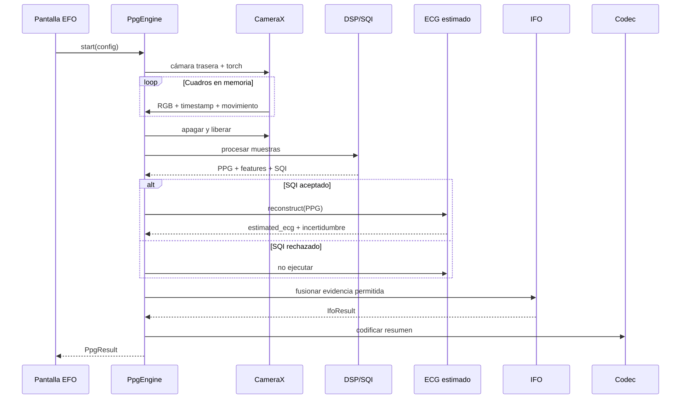

# Plano maestro de integración Kotlin

## 1. Objetivo del módulo

Integrar una capacidad offline que:

1. Adquiera PPG óptica mediante cámara trasera y flash.
2. Valide contacto, movimiento, temporalidad y pulsatividad.
3. Extraiga parámetros de señal.
4. Reconstruya una representación `estimated_ecg` cuando exista un modelo aprobado.
5. Genere un Indicador Fisiológico Orientativo (IFO) basado en evidencia trazable.
6. Codifique un resumen compacto para la capa de comunicación.

No diagnostica, no asigna prioridad clínica, no determina lesiones y no recomienda tratamientos.

## 2. Decisión de modularidad

Para la primera integración se usa un solo módulo Gradle `:ppg-core`, pero internamente se conservan fronteras que permiten separarlo después:

```text
com.<app>.physio
├── api/              PpgEngine, modelos públicos y estados
├── acquisition/      CameraX, RGB/YUV, torch y sensores
├── signal/           resampling, filtros, SQI y features
├── reconstruction/   PPG→estimated ECG y LiteRT
├── assessment/       observación directa e IFO fusion
├── protocol/         paquete binario/versionado
└── integration/      factory, DI y adaptadores de la app
```

La entrega actual usa temporalmente `com.helius.ppg`; la desarrolladora debe cambiar únicamente el namespace antes de integrar.

## 3. Dependencias entre capas

```text
UI de la app
   ↓ solo PpgEngine/StateFlow
integration
   ↓
api ← assessment ← reconstruction
 ↑        ↑              ↑
signal ← acquisition     LiteRT
   ↓
protocol
```

Regla: `acquisition` nunca conoce la UI, FastAPI ni el protocolo de comunicación externo. `signal` no depende de Android salvo tipos adaptadores. `assessment` no recibe imágenes.

## 4. Secuencia completa



## 5. API que verá la aplicación

```kotlin
interface PpgEngine {
    val state: StateFlow<PpgSessionState>
    val progress: StateFlow<PpgProgress>
    suspend fun start(config: PpgConfig = PpgConfig()): PpgResult
    suspend fun cancel()
}
```

La UI no debe acceder a `Camera`, `ImageProxy`, buffers RGB, LiteRT ni filtros.

## 6. Contrato del resultado

```text
PpgResult
├── sessionId
├── quality: SignalQuality
├── features: SignalFeatures?
├── classification: Classification
├── estimatedEcg: EstimatedEcg
├── ifo: IfoResult
├── packet: ByteArray
└── versions: ComponentVersions
```

Reglas:

- Si `quality.accepted=false`, `features` interpretables son nulas.
- `estimatedEcg.status=QUALITY_REJECTED` cuando falla el SQI.
- `estimatedEcg.samples` nunca se denomina ECG medido.
- `ifo` siempre conserva fuentes de evidencia.
- Un modelo ECG experimental no contribuye al IFO hasta activar explícitamente su release gate.

## 7. Construcción mediante factory

```kotlin
val engine: PpgEngine = CameraXPpgEngine(
    context = applicationContext,
    lifecycleOwner = lifecycleOwner,
    classifier = SafetyFirstClassifier(),
    ecgReconstructor = UnavailableEstimatedEcgReconstructor(),
    ifoFusion = IfoFusionEngine(allowEstimatedEcgContribution = false),
)
```

Cuando los modelos estén aprobados:

```kotlin
classifier = LiteRtPhysiologicalClassifier(...)
ecgReconstructor = LiteRtEstimatedEcgReconstructor(...)
ifoFusion = IfoFusionEngine(allowEstimatedEcgContribution = true)
```

El cambio ocurre en composición/DI, no en la pantalla.

## 8. Integración de pantalla

La pantalla debe observar `state` y `progress` desde un ViewModel. Acciones permitidas:

```text
StartMeasurement
CancelMeasurement
RetryMeasurement
DismissResult
```

Nunca iniciar automáticamente la cámara sin una acción o flujo de emergencia ya autorizado. En `onStop`, cancelar la sesión.

Copy mínimo:

- Instrucción: “Cubre cámara y flash con la yema sin presionar.”
- Progreso: “Analizando señal óptica.”
- Rechazo: motivo concreto y opción de repetir.
- ECG: “Representación ECG estimada; no es una medición eléctrica.”
- Resultado: “Observación informativa de señales; no es diagnóstico.”

## 9. Integración CameraX

1. Solicitar `CAMERA` antes de `start`.
2. Usar cámara trasera.
3. `YUV_420_888`, objetivo 640×480.
4. `STRATEGY_KEEP_ONLY_LATEST`.
5. Encender torch después del bind.
6. Permitir 1.5 s de estabilización.
7. Bloquear AE cuando el dispositivo lo soporte.
8. Procesar ROI sin `Bitmap`.
9. Cerrar cada `ImageProxy` en `finally`.
10. Apagar torch y `unbindAll` en toda salida terminal.

No se implementa `VideoCapture` ni `ImageCapture`; no hay archivo que borrar.

## 10. Integración de rolling shutter

Se implementa como un `FrameSignalExtractor` alternativo:

```kotlin
interface FrameSignalExtractor {
    fun extract(image: ImageProxy, metadata: CaptureMetadata): List<OpticalSample>
}

StandardFrameExtractor  // una muestra RGB por cuadro
RollingShutterExtractor // varias muestras ordenadas por grupos de filas
```

El factory selecciona rolling shutter solo si el dispositivo está en una whitelist validada. Nunca estimar temporalidad por filas sin conocer/calibrar rolling-shutter skew y exposición.

## 11. Integración LiteRT

Dos modelos separados:

```text
ppg_tiny_tcn_int8.tflite
ppg_to_estimated_ecg_int8.tflite
```

Cada asset incluye manifest:

```json
{
  "version": "1.0.0",
  "status": "approved",
  "sha256": "...",
  "preprocessor": "ppg-pre-v1",
  "input_shape": [1, 1800, 5]
}
```

Al iniciar:

1. Leer manifest.
2. Comprobar `status=approved`.
3. Verificar SHA-256.
4. Crear runtime una vez.
5. Preasignar buffers.
6. Reutilizar instancia con exclusión mutua.
7. Cerrar runtime cuando muera el scope de aplicación.

Si falla, usar baseline PPG y marcar ECG no disponible.

## 12. FastAPI

FastAPI queda fuera del camino urgente. Solo puede:

- publicar manifests/modelos aprobados;
- recibir datos de estudio con consentimiento explícito;
- registrar resultados de validación;
- administrar rollback.

La app conserva una versión aprobada empacada y funciona en modo avión.

## 13. Persistencia

Por defecto:

```text
frames: nunca persistir
RGB temporal: liberar al finalizar
PPG waveform: memoria; opcional cifrada solo en investigación
estimated ECG: memoria; opcional cifrada solo en investigación
summary packet: persistir únicamente si la capa de comunicación lo requiere
```

Toda persistencia de investigación requiere consentimiento, identificador seudónimo y política de retención.

## 14. Errores públicos

```text
CAMERA_PERMISSION_DENIED
BACK_CAMERA_UNAVAILABLE
TORCH_UNAVAILABLE
CAMERA_BIND_FAILED
SESSION_TIMEOUT
NO_FINGER
EXCESSIVE_MOTION
LOW_PULSATILITY
FRAME_GAPS
THERMAL_LIMIT
MODEL_UNAVAILABLE
MODEL_HASH_MISMATCH
MODEL_INFERENCE_FAILED
INTERNAL_PROCESSING_ERROR
```

Los errores técnicos nunca se convierten en observaciones fisiológicas.

## 15. Orden exacto de implementación

### Etapa A — Integración segura sin IA

1. Importar `ppg-core`.
2. Cambiar namespace.
3. Conectar permiso y lifecycle.
4. Mostrar estados/progreso.
5. Validar torch y limpieza.
6. Ejecutar PPG + SQI + baseline.
7. Generar paquete v1.

Resultado: funcional offline sin pesos.

### Etapa B — Equivalencia de señal

1. Crear fixtures compartidos Python/Kotlin.
2. Congelar resampling/filtros.
3. Verificar características y BPM.
4. Ensayar dispositivos LEGACY/LIMITED/FULL.

### Etapa C — Estimated ECG en shadow mode

1. Integrar student FP32.
2. Ejecutarlo sin mostrar ni afectar IFO.
3. Comparar contra referencia.
4. Integrar INT8.
5. Calibrar incertidumbre.

### Etapa D — Modelos aprobados

1. Activar clasificador directo aprobado.
2. Activar visualización estimada.
3. Mantener `allowEstimatedEcgContribution=false`.
4. Solo tras validación incremental activar contribución al IFO.

### Etapa E — Rolling shutter

1. Implementar extractor por filas.
2. Calibrar teléfonos concretos.
3. Crear whitelist firmada/versionada.
4. Comparar modo estándar vs RS-PPG.

## 16. Definition of Done

- Modo avión completo.
- Cero imágenes/videos persistidos.
- Torch apagado en 100 % de estados terminales.
- Señal mala nunca genera observación válida.
- Modelos inválidos no se cargan.
- Estimated ECG siempre rotulado.
- Pruebas golden del paquete binario.
- Pruebas de lifecycle y cancelación.
- Latencia/RAM/temperatura medidas en dispositivo mínimo.
- Reporte de validación por sujeto y teléfono.
- Intended-use y copy aprobados antes de despliegue externo.
